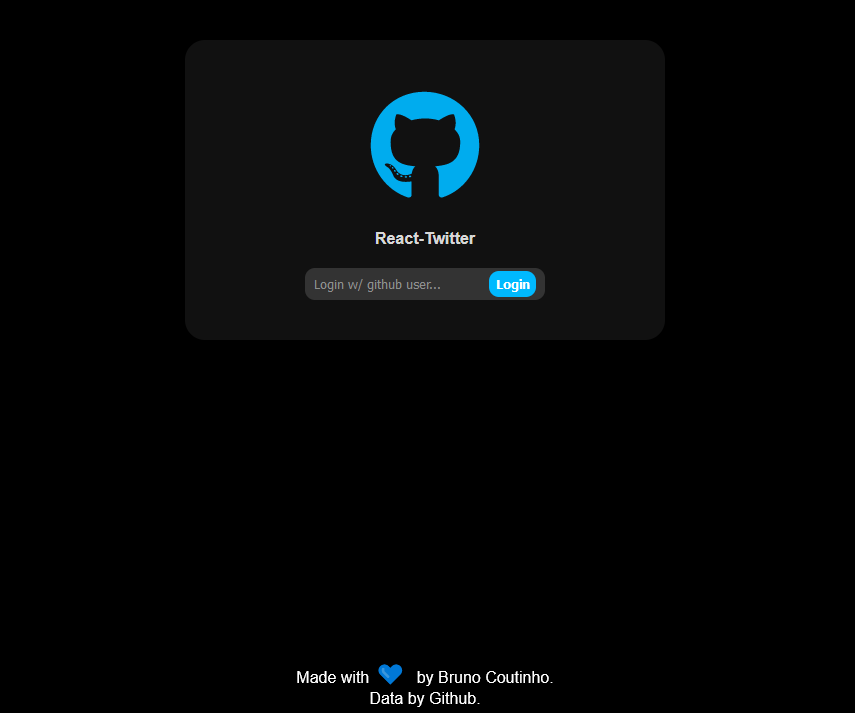
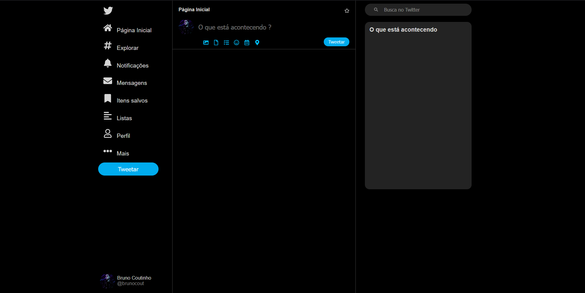

<p align="center">
  
</p>

## Sobre o projeto:

<p align="center">Projeto que traz um clone do twitter mesclado com a api do github para trazer informações de usuário e login.</p>

## Recursos

- [x] Login com usuario do Github
- [x] Interface do Twitter
- [ ] Postagem e comentário
- [ ] Layout responsivo para mobile
- [ ] Integração com backend

## Layout

Layout da aplicação:

 ### Web

<p align="center" style="display: flex; align-items: flex-start; justify-content: center;">
  
  
  
</p>


## Tecnologias

As seguintes ferramentas estão sendo usadas na construção do projeto:

- [Vite](https://vitejs.dev/)
- [React](https://pt-br.reactjs.org/)
- [JavaScript](https://developer.mozilla.org/pt-BR/docs/Learn/Getting_started_with_the_web/JavaScript_basics)

## Iniciando

Primeiro, execute o servidor de desenvolvimento:

```bash
npm run dev
# ou
yarn dev
```

Abra [http://localhost:3000](http://localhost:3000) no seu navegador e veja o resultado.

### Autor
---

<a href="https://github.com/brunocout">
 
 <br />
</a>

Feito com 💙 por Bruno Coutinho!

[](https://www.linkedin.com/in/brunocout/) 
[](mailto:iambrunocout@gmail.com)

##  Versões do README

[ Inglês 🇺🇸 ](./README.md) | [Português 🇧🇷](./README-br.md) 