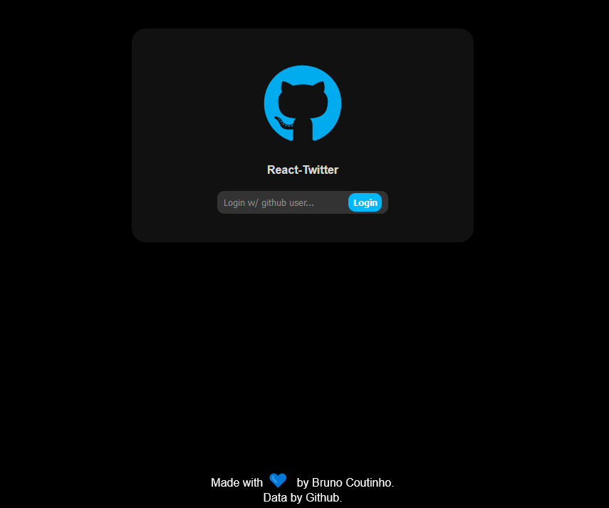

<p align="center">
  
</p>

## About the project

<p align="center">In this project that brings a twitter clone merged with the github api to bring user and login information.</p>

## Features

- [x] Login w/ Github user
- [x] Twitter interface
- [ ] Post and comments
- [ ] Responsive layout for mobile
- [ ] Integration w/ backend

## Layout

The application layout:

 ### Web

<p align="center" style="display: flex; align-items: flex-start; justify-content: center;">
  
  
  
</p>


## Technologies

The following tools are being used in building the project:

- [Vite](https://vitejs.dev/)
- [React](https://pt-br.reactjs.org/)
- [JavaScript](https://developer.mozilla.org/pt-BR/docs/Learn/Getting_started_with_the_web/JavaScript_basics)

## Getting Started

First, run the development server:

```bash
npm run dev
# or
yarn dev
```

Open [http://localhost:3000](http://localhost:3000) with your browser to see the result.

### Autor
---

<a href="https://github.com/brunocout">
 
 <br />
</a>

Made w/ 💙 by Bruno Coutinho!

[](https://www.linkedin.com/in/brunocout/) 
[](mailto:iambrunocout@gmail.com)

##  README version

[ English 🇺🇸 ](./README.md)  |  [Português 🇧🇷](./README-br.md)